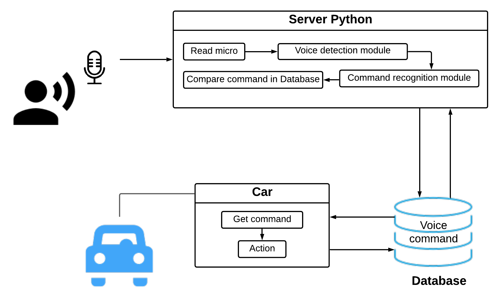

# PBL5-Speech-Recognition-Viet-Nam

Trong đề tài này sử dụng mô hình Deep-Learning CNN vì vậy để run code phải activate được GPU trên laptop hoặc đưa code lên
trên Google Colab hoặc Keras để run.

## Tổng quan mô hình
Nếu sử dụng RASP :

Nếu không sử dụng RASP :

## Quá trình ghi âm
- Có thể sử dụng Audio để ghi âm tuy nhiên nếu muốn đồng nhất các file ghi âm có cùng độ dài 
  và kiểm tra xem quá trình ghi âm có phát hiện giọng nói hay không thì ta có thể run file :
  
Code Test/Record_Detect.py

- Sau khi run file và ghi âm nếu phát hiện giọng nói sẽ xuất ra hình ảnh như sau : 

## Mô hình phát hiện giọng nói 

### Chi tiết phần VAD ( Voice activity Detection)

## Quá trình Train

- Để huấn luyện sử dụng Google Colab để train và sử dụng 2 file sau : 
  + Speech Recognition Colab/Speech_Recogination_Ver_Final.ipynb
      + File .ipynb này sẽ chạy trên Colab hoặc activate anaconda trên máy để chạy.
  + input/train_split (dataset để train)
      + Ở đây chỉ train với những từ như quay trái, quay phải, đi tới, đi lui, sang phải, sang trái, dừng lại
      + Nếu muốn train thêm chỉ cần tạo thư mục chứa tất cả từ giống nhau bỏ vào là được  
  
- Sau khi quá trình huấn luyện hoàn tất sẽ trích xuất ra file .hdf5
## Mô hình huấn luyện 

## Quá trình Test

- Load model tốt nhất trong thư mục lưu best-model-hdf5
  
- ***Lưu ý để Quá trình test ta cần phải activate được GPU trên máy hoặc sử dụng Google Colab***

- open anaconda cmd :

  - conda activate tf-gpu

  - cd ToYourDirectory
  
  - python Final_GUI.py

***Chú ý cần phải cd vào thư mục Final-No-Rasp bởi vì sử dụng PyQT5 dữ liệu hình ảnh phải lấy ngay trong thư mục chứa***

- Sau khi run python Final_GUI.py thì ta có giao diện sau : 

  
- Button Start : 
  1. Sau khi bấm nút Start quá trình ghi âm sẽ diễn ra trong vòng 4s
  2. Sau khi ghi âm xong tự động gọi hàm Detect Voice để phát hiện tiếng nói
  3. Thông qua mô hình nhận diện giọng nói dự đoán và xuất ra kết quả
  
- Button Predict : 
  + Là quá trình dự đoán kết quả tuy nhiên lúc này predict dự đoán thông qua file test.wav
  
- Button SEND DATA : 
  + Gửi dữ liệu qua module HC05 và điều khiển xe.
  
- Code tiếp nhận và điều khiển xe sử dụng arduino nằm ở trong phần : 
  + Code_Test/Robot.ino
  
***Quá trình Test thì cần phải activate anaconda còn các file khác thì có thể run trong môi trường nào cũng được***

